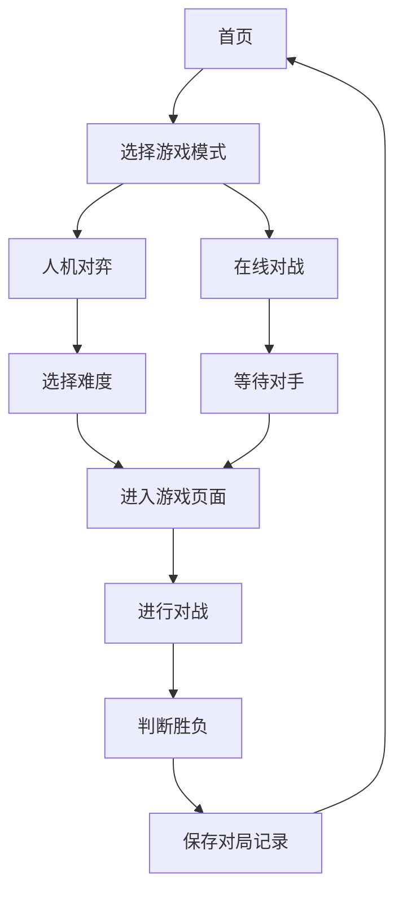

## 1. Product Overview
AI 象棋是一款基于网页的智能象棋游戏，提供人机对弈和在线对战功能。
- 主要目的是为象棋爱好者提供一个便捷、智能的象棋对战平台，解决线下对弈不便的问题。
- 目标用户包括象棋爱好者、初学者和专业棋手，市场价值在于提供高质量的象棋对战体验和AI训练平台。

## 2. Core Features

### 2.1 User Roles
| Role | Registration Method | Core Permissions |
|------|---------------------|------------------|
| 游客用户 | 无需注册 | 可进行人机对弈，体验基本功能 |
| 注册用户 | 邮箱注册 | 可进行人机对弈、在线对战、查看历史记录、保存对局 |

### 2.2 Feature Module
1. **首页**: 游戏介绍、开始游戏按钮、难度选择、用户登录/注册
2. **游戏页面**: 棋盘界面、走棋逻辑、AI对战、在线对战、聊天功能
3. **个人中心**: 历史对局、个人信息、设置

### 2.3 Page Details
| Page Name | Module Name | Feature description |
|-----------|-------------|---------------------|
| 首页 | 游戏介绍 | 展示游戏特色、AI能力、用户评价 |
| 首页 | 开始游戏 | 提供人机对弈和在线对战选项 |
| 首页 | 难度选择 | 提供不同难度级别的AI对手 |
| 首页 | 用户登录/注册 | 允许用户登录或注册新账号 |
| 游戏页面 | 棋盘界面 | 显示棋盘和棋子，支持棋子移动 |
| 游戏页面 | 走棋逻辑 | 验证棋子移动规则，判断胜负 |
| 游戏页面 | AI对战 | 提供智能AI对手，不同难度级别 |
| 游戏页面 | 在线对战 | 支持与其他用户实时对战 |
| 游戏页面 | 聊天功能 | 允许对战双方进行文字交流 |
| 个人中心 | 历史对局 | 查看和回放历史对战记录 |
| 个人中心 | 个人信息 | 查看和修改个人资料 |
| 个人中心 | 设置 | 调整游戏音效、棋盘风格等 |

## 3. Core Process
用户访问首页，选择游戏模式（人机对弈或在线对战），设置游戏难度，进入游戏页面。在游戏页面中，用户与AI或其他用户进行对战，系统判断胜负，结束后保存对局记录。

## 4. User Interface Design
### 4.1 Design Style
- 主色调：深蓝色 (#1a237e) 和金色 (#ffd700)
- 次要色：浅灰色 (#f5f5f5) 和深灰色 (#333333)
- 按钮样式：圆角矩形，有轻微的3D效果
- 字体：主标题使用 serif 字体，正文使用 sans-serif 字体
- 布局风格：卡片式布局，顶部导航栏
- 图标风格：简约线条风格，使用象棋相关的图标

### 4.2 Page Design Overview
| Page Name | Module Name | UI Elements |
|-----------|-------------|-------------|
| 首页 | 游戏介绍 | 大型英雄区域，展示象棋棋盘和棋子，使用深蓝色背景，金色装饰 |
| 首页 | 开始游戏 | 突出显示的大按钮，使用金色背景，悬停时有动画效果 |
| 首页 | 难度选择 | 下拉菜单或单选按钮组，使用卡片式设计 |
| 首页 | 用户登录/注册 | 模态框形式，简洁的表单设计 |
| 游戏页面 | 棋盘界面 | 传统象棋棋盘设计，棋子使用经典样式，移动时有动画效果 |
| 游戏页面 | 走棋逻辑 | 高亮显示可移动的棋子和目标位置 |
| 游戏页面 | AI对战 | 显示AI思考时间，提供悔棋和重新开始按钮 |
| 游戏页面 | 在线对战 | 显示对手信息，提供聊天窗口 |
| 个人中心 | 历史对局 | 表格形式展示历史记录，支持筛选和搜索 |
| 个人中心 | 个人信息 | 简洁的表单设计，支持头像上传 |
| 个人中心 | 设置 | 开关和滑块控件，分组展示不同设置选项 |

### 4.3 Responsiveness
- 桌面优先设计，支持响应式布局
- 移动端适配：调整棋盘大小和控件位置，确保触摸操作便捷
- 触摸优化：增大可点击区域，支持触摸手势操作

### 4.4 3D Scene Guidance
- 棋盘使用轻微的3D效果，增强视觉深度
- 棋子移动时使用平滑的动画效果
- 胜利/失败时使用视觉效果增强游戏体验