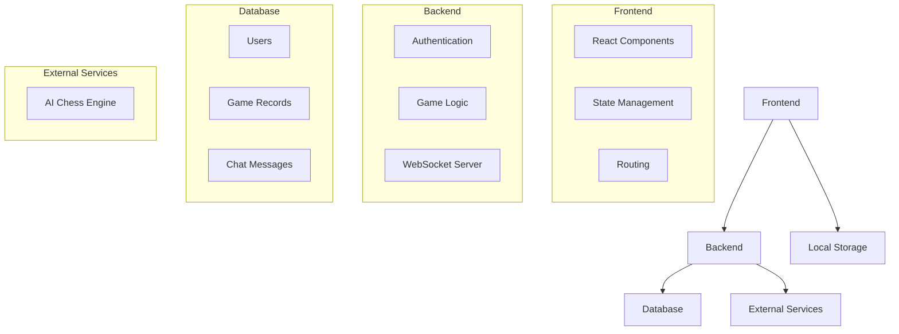
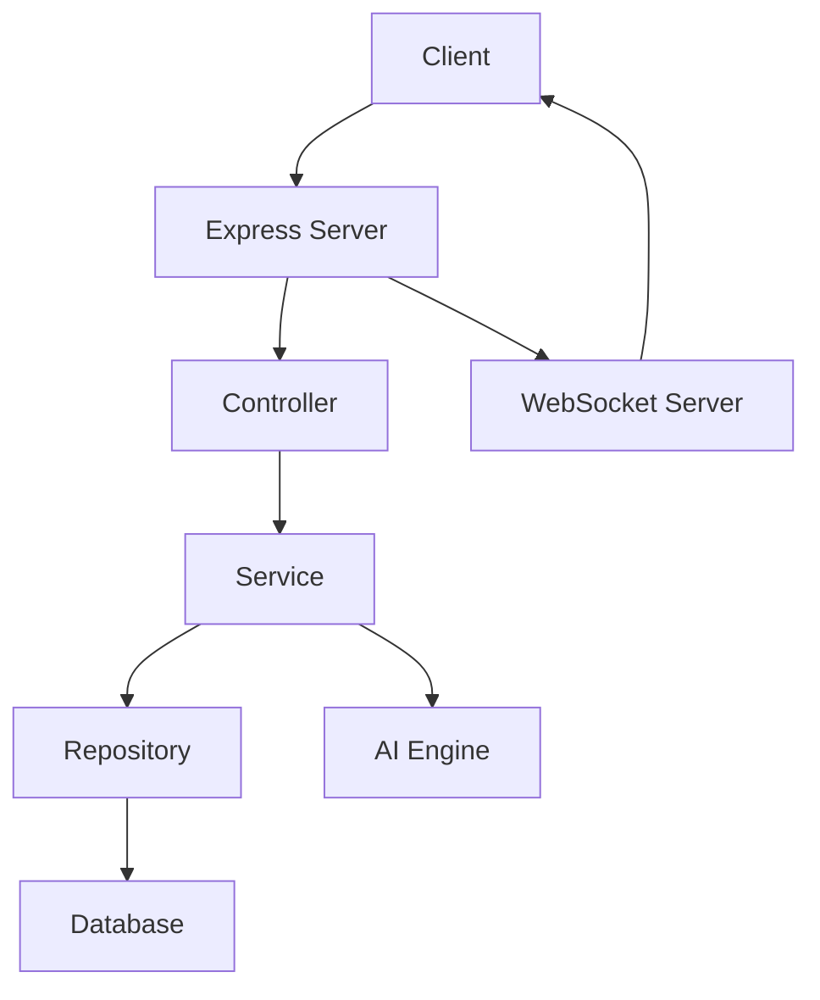
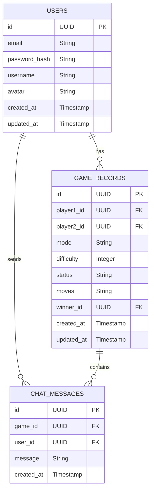

## 1. Architecture Design


## 2. Technology Description
- Frontend: React@18 + TypeScript + Tailwind CSS@3 + Vite
- Initialization Tool: vite-init
- Backend: Supabase (for authentication and database) + Express.js (for WebSocket and AI integration)
- Database: Supabase (PostgreSQL)
- AI Engine: Stockfish.js (client-side) for basic AI, server-side Stockfish for advanced AI
- WebSocket: Socket.io for real-time communication

## 3. Route Definitions
| Route | Purpose |
|-------|---------|
| / | 首页，包含游戏介绍和开始游戏选项 |
| /game | 游戏页面，进行人机对弈或在线对战 |
| /profile | 个人中心，查看历史记录和个人信息 |
| /login | 用户登录页面 |
| /register | 用户注册页面 |

## 4. API Definitions

### 4.1 Authentication API
| Endpoint | Method | Description | Request Body | Response |
|----------|--------|-------------|--------------|----------|
| /api/auth/login | POST | 用户登录 | { email: string, password: string } | { user: object, token: string } |
| /api/auth/register | POST | 用户注册 | { email: string, password: string, username: string } | { user: object, token: string } |
| /api/auth/logout | POST | 用户登出 | N/A | { success: boolean } |

### 4.2 Game API
| Endpoint | Method | Description | Request Body | Response |
|----------|--------|-------------|--------------|----------|
| /api/game/create | POST | 创建游戏 | { mode: string, difficulty: number } | { gameId: string } |
| /api/game/join | POST | 加入游戏 | { gameId: string } | { game: object } |
| /api/game/move | POST | 执行走棋 | { gameId: string, move: string } | { success: boolean, gameState: object } |
| /api/game/history | GET | 获取历史对局 | N/A | { games: array } |

### 4.3 User API
| Endpoint | Method | Description | Request Body | Response |
|----------|--------|-------------|--------------|----------|
| /api/user/profile | GET | 获取用户信息 | N/A | { user: object } |
| /api/user/profile | PUT | 更新用户信息 | { username: string, avatar: string } | { user: object } |

## 5. Server Architecture Diagram


## 6. Data Model

### 6.1 Data Model Definition


### 6.2 Data Definition Language
```sql
-- Create users table
CREATE TABLE users (
    id UUID PRIMARY KEY DEFAULT gen_random_uuid(),
    email VARCHAR(255) UNIQUE NOT NULL,
    password_hash VARCHAR(255) NOT NULL,
    username VARCHAR(50) NOT NULL,
    avatar VARCHAR(255),
    created_at TIMESTAMP DEFAULT NOW(),
    updated_at TIMESTAMP DEFAULT NOW()
);

-- Create game_records table
CREATE TABLE game_records (
    id UUID PRIMARY KEY DEFAULT gen_random_uuid(),
    player1_id UUID REFERENCES users(id),
    player2_id UUID REFERENCES users(id),
    mode VARCHAR(20) NOT NULL, -- 'ai' or 'online'
    difficulty INTEGER,
    status VARCHAR(20) NOT NULL, -- 'pending', 'in_progress', 'completed'
    moves TEXT NOT NULL, -- JSON string of moves
    winner_id UUID REFERENCES users(id),
    created_at TIMESTAMP DEFAULT NOW(),
    updated_at TIMESTAMP DEFAULT NOW()
);

-- Create chat_messages table
CREATE TABLE chat_messages (
    id UUID PRIMARY KEY DEFAULT gen_random_uuid(),
    game_id UUID REFERENCES game_records(id),
    user_id UUID REFERENCES users(id),
    message TEXT NOT NULL,
    created_at TIMESTAMP DEFAULT NOW()
);

-- Create indexes
CREATE INDEX idx_game_records_player1_id ON game_records(player1_id);
CREATE INDEX idx_game_records_player2_id ON game_records(player2_id);
CREATE INDEX idx_chat_messages_game_id ON chat_messages(game_id);

-- Grant permissions
GRANT SELECT ON users, game_records, chat_messages TO anon;
GRANT ALL PRIVILEGES ON users, game_records, chat_messages TO authenticated;
```