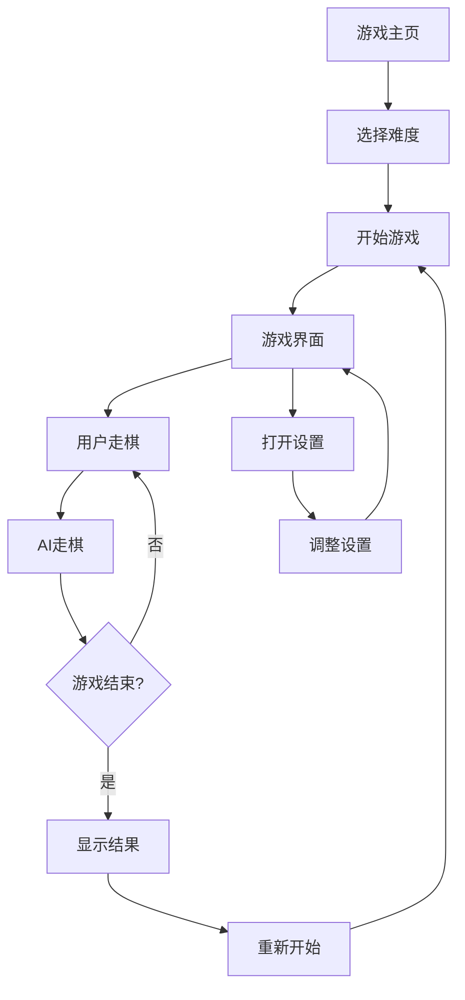

## 1. Product Overview
AI象棋是一个基于网页的象棋游戏，支持玩家与AI对战，提供不同难度级别。
- 旨在为象棋爱好者提供一个便捷的在线对战平台，无需下载安装即可体验。
- 目标用户为象棋爱好者，适合各水平层次的玩家。

## 2. Core Features

### 2.1 User Roles
| Role | Registration Method | Core Permissions |
|------|---------------------|------------------|
| Player | No registration required | Play chess against AI, adjust difficulty settings |

### 2.2 Feature Module
1. **游戏主页**: 游戏标题、开始按钮、难度选择、游戏规则
2. **游戏界面**: 棋盘、棋子、移动提示、游戏状态、重新开始按钮
3. **设置页面**: 难度调整、音效开关、主题选择

### 2.3 Page Details
| Page Name | Module Name | Feature description |
|-----------|-------------|---------------------|
| 游戏主页 | 游戏标题 | 显示游戏名称和简短介绍 |
| 游戏主页 | 开始按钮 | 点击进入游戏界面 |
| 游戏主页 | 难度选择 | 提供简单、中等、困难三个难度级别 |
| 游戏主页 | 游戏规则 | 显示基本象棋规则说明 |
| 游戏界面 | 棋盘 | 显示标准象棋棋盘和棋子 |
| 游戏界面 | 棋子 | 支持棋子移动、吃子、将军等操作 |
| 游戏界面 | 移动提示 | 显示可移动的位置和最佳走法提示 |
| 游戏界面 | 游戏状态 | 显示当前轮到谁走棋、游戏结果等信息 |
| 游戏界面 | 重新开始按钮 | 点击重新开始游戏 |
| 设置页面 | 难度调整 | 调整AI难度级别 |
| 设置页面 | 音效开关 | 控制游戏音效 |
| 设置页面 | 主题选择 | 切换棋盘和棋子主题 |

## 3. Core Process
用户打开游戏主页，选择难度级别，点击开始游戏进入游戏界面。在游戏界面中，用户与AI轮流走棋，直到游戏结束（将死、和棋或认输）。用户可以随时重新开始游戏或调整设置。

## 4. User Interface Design
### 4.1 Design Style
- 主色调：深蓝色(#1a2b3c)和木质棕色(#8b5a2b)
- 次要色：金色(#ffd700)和红色(#ff4500)
- 按钮风格：圆角矩形，有轻微的3D效果
- 字体：无衬线字体，标题使用较大字号
- 布局风格：居中布局，棋盘位于页面中央
- 图标风格：简约线条风格，使用象棋相关图标

### 4.2 Page Design Overview
| Page Name | Module Name | UI Elements |
|-----------|-------------|-------------|
| 游戏主页 | 游戏标题 | 大号字体，金色，有阴影效果 |
| 游戏主页 | 开始按钮 | 深蓝色背景，白色文字，悬停时变为金色 |
| 游戏主页 | 难度选择 | 三个选项按钮，选中状态为金色 |
| 游戏界面 | 棋盘 | 木质纹理背景，黑色边框，32个深色和浅色方格 |
| 游戏界面 | 棋子 | 3D效果，黑色和红色棋子，移动时有动画效果 |
| 游戏界面 | 移动提示 | 可移动位置显示绿色高亮，最佳走法显示蓝色高亮 |
| 游戏界面 | 游戏状态 | 位于棋盘上方，显示当前玩家和游戏结果 |
| 设置页面 | 难度调整 | 滑块控件，从简单到困难 |
| 设置页面 | 音效开关 | 开关按钮，开启状态为蓝色 |
| 设置页面 | 主题选择 | 预览图选择，显示不同棋盘和棋子主题 |

### 4.3 Responsiveness
- 桌面优先设计，适配1024px以上屏幕
- 平板设备适配768px-1023px屏幕
- 移动设备适配320px-767px屏幕，棋盘大小自动调整
- 触摸优化，支持移动设备触摸操作

### 4.4 3D Scene Guidance
- 棋盘采用轻微的3D视角，增强视觉效果
- 棋子有轻微的阴影和高光，提升立体感
- 移动棋子时有平滑的动画效果
- 将军时棋盘有轻微的震动效果
- 游戏结束时有胜利或失败的动画效果