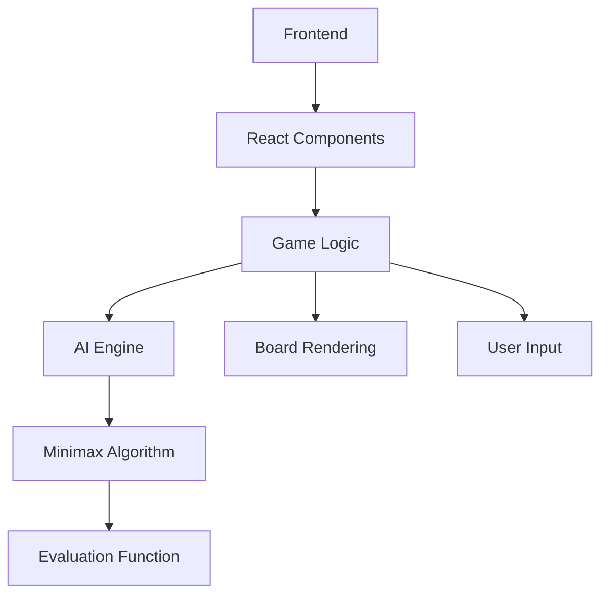
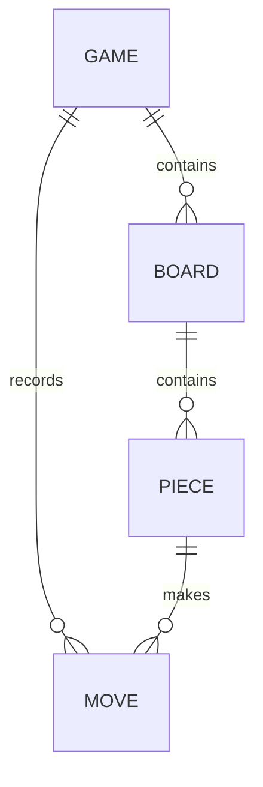

## 1. Architecture Design

## 2. Technology Description
- Frontend: React@18 + TypeScript + Tailwind CSS + Vite
- Initialization Tool: Vite
- Backend: None (all logic runs client-side)
- AI Engine: Custom implementation using Minimax algorithm with alpha-beta pruning
- Build Tool: Vite for development and electron-builder for desktop packaging

## 3. Route Definitions
| Route | Purpose |
|-------|---------|
| / | Game homepage with difficulty selection |
| /game | Main game interface |
| /settings | Game settings page |

## 4. API Definitions
No backend API required as all logic runs client-side.

## 5. Server Architecture Diagram
Not applicable as no backend server is used.

## 6. Data Model
### 6.1 Data Model Definition

### 6.2 Data Definition
- **Game State**: Represents the current state of the game, including board position, current player, game status, and difficulty level
- **Board**: 8x8 grid of squares, each square can contain a piece or be empty
- **Piece**: Represents a chess piece with type (pawn, rook, knight, bishop, queen, king), color (red, black), and position
- **Move**: Represents a move from one position to another, including piece moved, start position, end position, and any special move flags (e.g., castling, en passant)

## 7. AI Implementation
- **Algorithm**: Minimax with alpha-beta pruning
- **Depth**: Adjustable based on difficulty level (easy: 2-3, medium: 4-5, hard: 6-7)
- **Evaluation Function**: Considers material balance, piece position, mobility, king safety, and pawn structure
- **Optimizations**: Move ordering, transposition table, iterative deepening

## 8. Build and Deployment
- **Web Build**: Vite build for web deployment
- **Desktop Build**: Electron-builder for packaging as Windows exe, macOS app, and Linux binary
- **Static Files**: All game assets (images, sounds) bundled with the build

## 9. Performance Considerations
- **Board Representation**: Use bitboards for efficient move generation
- **AI Performance**: Use Web Workers for AI calculations to avoid blocking the main thread
- **Rendering**: Use React.memo and useCallback for optimized rendering
- **Responsiveness**: Use CSS Grid and Flexbox for responsive layout

## 10. Future Enhancements
- **Multiplayer**: Add online multiplayer functionality
- **Tournament Mode**: Add tournament-style gameplay
- **Analysis Mode**: Add move analysis and suggestion features
- **Custom Themes**: Allow users to create and share custom board and piece themes